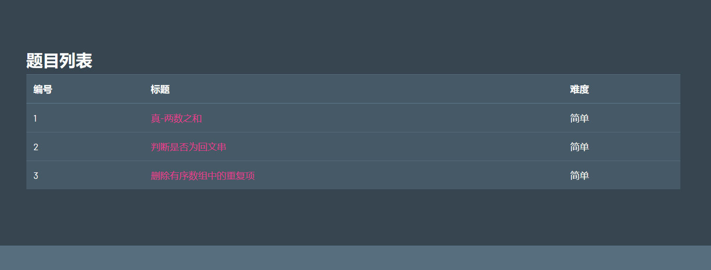
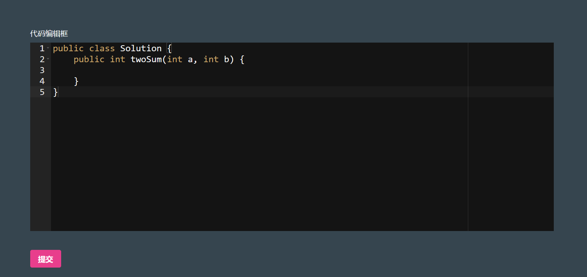
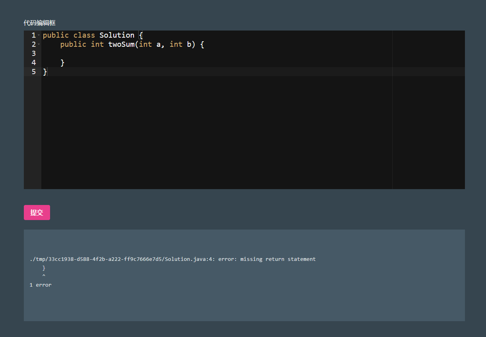
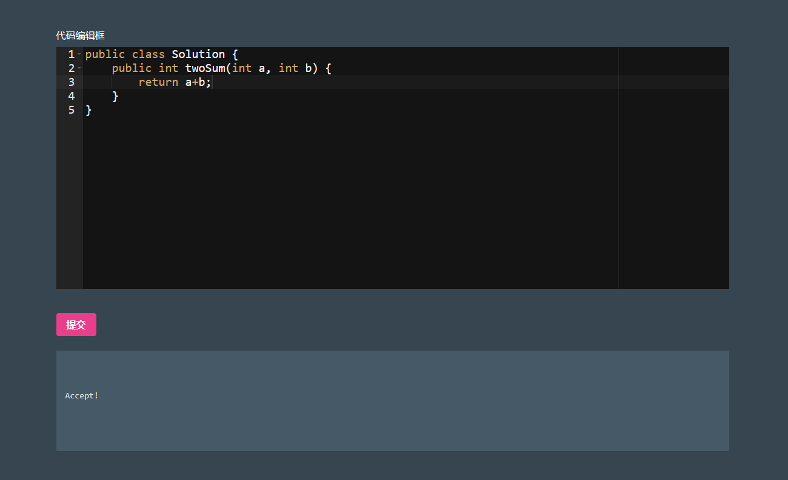

# 基于Java Servlet搭建的在线OJ平台

## 核心功能

1. 题目保存
2. 展示题目列表
3. 展示题目详情
4. 提交题目代码运行
5. 管理员-新增题目 [暂未开发]
6. 管理员-删除题目 [暂未开发]
7. 管理员-用户管理 [暂未开发]

## 所需技能

1. Java基础语法, 无需多言

2. 理解多进程编程
   - 可以先去了解Linux的exec系列系统接口(C语言风格)
   - 再去了解Java的Runtime单例
3. MySQL或者任意数据库
   - 建库建表
   - 向表中插入以及查询
4. 对网络的操作（基于maven框架）
5. 部分前端知识（会改即可）

## 演示效果

- 题目列表

- 题目说明

  

- 代码编辑框以及默认代码

  

- 编译错误演示

- 成功通过所有用例

